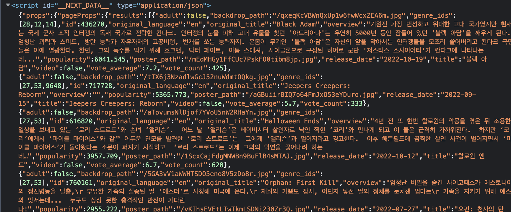

# Mini Movie App

## 1) Layout 패턴

-   https://github.com/yoojh9/nextjs/commit/ff981966e0e8a5dfc6425013602c3d0e3494cbe2

<br>

### (1) Head

-   Next.js가 제공하는 head component를 사용해보자.
-   Next.js가 가진 멋진 점은 이런 작은 패키지들을 사용할 수 있다는 것이다

<br>

```javascript
import Head from "next/head";
```

<br>

-   만약 Next.js가 아닌 create-react-app으로 앱의 head 부분을 관리한다면 react helmet 같은 라이브러리를 다운해야 된다. 그 말은 우리 프로젝트완느 별개로 새로운 컴포넌트, 코드, 오류 등이 생긴다는 것이다.

-   https://github.com/yoojh9/nextjs/commit/d049ce4b686aa352bb10dd501533775f9a5cc27f

<br><br>

## 2) Fetching Data

-   Movie Data: https://www.themoviedb.org/
-   https://github.com/yoojh9/nextjs/commit/2acf9f2521dfe34f3952d3d158dbfffcfd9bcfeb

<br><br>

## 3) Redirect and Rewrite

### (1) Redirect

-   next.config.js에서 redirect 설정도 할 수 있다.
-   아래 코드는 /contact로 접근할 시 /form으로 redirect 된다.
-   우리 website 안에서든, 바깥으로든 redirect 할 수 있다.
-   서버 설정이 바뀌는 것이므로 서버 restart 필요.

<br>

```javascript
const nextConfig = {
    reactStrictMode: true,
    swcMinify: true,
    async redirects() {
        return [
            {
                source: "/contact",
                destination: "/form",
                permanent: false,
            },
        ];
    },
};

module.exports = nextConfig;
```

<br>

```javascript
const nextConfig = {
    reactStrictMode: true,
    swcMinify: true,
    async redirects() {
        return [
            {
                source: "/old-blog/:path",
                destination: "/new-blog/:path",
                permanent: false,
            },
        ];
    },
};

module.exports = nextConfig;
```

<br>

### (2) Rewrite

-   rewirtes는 유저를 redirect 시키기는 하지만 URL은 변하지 않는다.
-   그래서 index.js에서 fetch 한 API_KEY를 숨기고 싶다면 rewrites를 이용한다.
-   이 방법으로 NextJS가 Request를 Masking 할 수 있음. (마스크를 씌울 수 있음..)

```javascript
// next.config.js

const API_KEY = "###########";

async rewrites() {
    return [
      {
          source: "/api/movies",
          destination: `https://api.themoviedb.org/3/movie/popular?api_key=${API_KEY}&language=ko-KR`
      }
    ]
  }

```

<br>

-   위 API_KEY는 .env 파일로도 작업할 수 있다.
-   https://github.com/yoojh9/nextjs/commit/c5c3d6d0f4747f3782f0183520da2b8190ad1835

<br><br>

## 4) Server Side Rendering

-   NextJS는 오직 server side render만 할지 선택할 수 있게 한다.
-   NextJS는 우리 app을 pre-render 하고 초기 화면으로 html을 준다.
-   지금 우리가 만든 코드는 데이터가 로드 되기 전에 'loading...' 화면을 보여주는데, 이 화면을 보여주기 싫을 수도 있다. fetch나 server에서 일어나는 data 관련된 작업을 모두 처리한 다음에 API가 모두 완료되었을 때 그때 페이지를 render하고 싶을 수도 있다.

<br>

### (1) getServerSideProps()

-   이 안에 어떤 코드를 쓰든 그 코드는 server에서 돌아가게 된다. client 쪽이 아니라 server 쪽에서만 작동한다.
-   이 함수를 이용해서 API_KEY를 숨길수도 있다. API_KEY를 여기에 써준다면 절대로 client에게 보여지지 않는다. 이 코드는 오직 server(백엔드)에서만 실행된다.

<br>

```javascript
export async function getServerSideProps() {}
```

<br>

-   Fetch 작업을 getServerSideProps() 안에서 수행할 수도 있다.
-   getServerSideProps()는 Object를 리턴하는데, 그 Object는 props라는 key 혹은 property를 가진다.
-   props에는 원하는 데이터를 아무거나 넣을 수 있다.

```javascript
export default function Home({results}) {
    ...
}

export async function getServerSideProps() {
    const { results } = await (await fetch("/api/movies")).json();

    return {
        props: {
            results,
        }
    };
}

```

<br>

-   getServerSideProps()는 server에서 실행된다. 그리고 무엇을 return하든 그것을 props로써 page에 주게 된다.
-   원한다면 server side를 통해 props를 page로 보낼 수 있다는 것이다. 이게 바로 pageProps가 필요한 이유이다 (\_app.js > pageProps)
-   만약에 우리가 홈으로 진입하게 되면, next.js는 Home을 받아서 render 하기 위해 \_app.js의 Component props에 넣을 거고, 그리고 getServerSideProps()를 호출한다. next.js는 우리가 getServerSideProps를 사용할 거라는 걸 알게 되고, API를 호출하여 응답 받은 데이터를 props로 리턴한다. 그러면 next.js가 그 props를 pageProps에 넣는다. 결국은 Home에서 pageProps를 results를 받을 수 있다.

<br>

-   하지만 실행하게 되면 위 getServerSideProps()는 'Only absolute URLs are supported' 라는 에러 메세지가 나온다. '/api/movies'는 front에서만 작동하므로 서버에서는 작동하지 않는다. 그러므로 'https://localhost:3000/api/movies'로 변경한다.

<br>

```javascript
export async function getServerSideProps() {
    const { results } = await (
        await fetch("http://localhost:3000/api/movies")
    ).json();

    return {
        props: {
            results,
        },
    };
}
```

<br>

-   이제 index.js는 100% server-side에서 render 된다. 이제 API를 호출한 값이 들어오기 전까지 화면에 아무것도 안 보이므로 'loading...' 작업은 필요 없다.

-   여기서 선택이 시작된다. 항상 server side rendering을 하고 싶은가? 즉, 데이터가 유효할 때 화면에 보여지게 되는게 좋은지. 또는 loading 화면을 보여준 다음에 데이터를 받는게 좋은지

-   NextJS가 백엔드에서 받아온 props를 return 해서 가져다주면, ReactJS는 저 props를 가져와서 그걸가지고 화면에 그려준다.

-   결국 우리가 한 건, page가 유저에게 보여지기 전에 props를 받아오는 function을 만드는 작업이다. getServerSideProps()에서 뭐가 return 되든 페이지의 props 값으로 사용된다.

-   더 이상 loading 화면은 없는 대신, 만약 API load가 느리다면 유저가 아무것도 보지 못한 채로 오래 기다려야 한다는 단점이 있다. 선택은 개발자의 몫이다.

-   NextJS는 Props들을 아래 이미지와 같이 \_\_NEXT_DATA\_\_ 부분에 넣어준다. ReactJS가 로드 되면 백엔드에서 만들어진 모든 State들을 장악하여 ReactJS를 이용해 상호작용이 가능해진다.



-   서버 사이드 렌더링의 경우 데이터가 HTML에 다 보여지므로 검색 엔진에게는 좋다.

-   https://github.com/yoojh9/nextjs/commit/473c63ed390b5423dcd212e0c5faf4c867ff5f06
